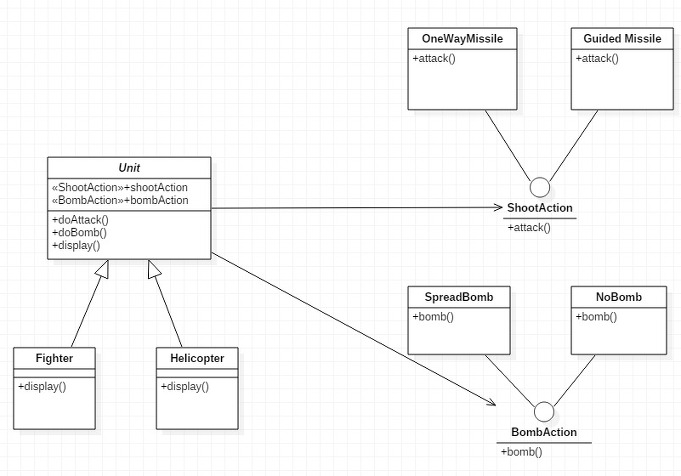

2019 5 13

Strategy Pattren 공부를 해보았다

간단하게 말해 어떤 동작을 하는 로직을 정의하고 이것들을 하나로 묶어서(캡슐화) 관리하도록 하는 패턴이다.
로직을 사용하는 객체들은 자기의 입맛에 맞게 로직을 효율적으로 수정할 수 있다.
새로운 로직을 추가하거나 변경할 때 객체의 종류 수 만큼 반복하지 않고, 단 한번으로 반영할 수 있다.



그림과 다른내용이지만 나는 이 소스가 이해가 쉽게 되었다

```java
class UpBehavior implements CarMoveBehavior{
    @Override public void action(){
        System.out.println("Up!");
    }
}
class DownBehavior implements CarMoveBehavior{
    @Override public void action(){
        System.out.println("Down!");
    }
}
class LeftBehavior implements CarMoveBehavior{
    @Override public void action(){
        System.out.println("Left!");
    }
}
class RightBehavior implements CarMoveBehavior{
    @Override public void action(){
        System.out.println("Right!");
    }
}
```


