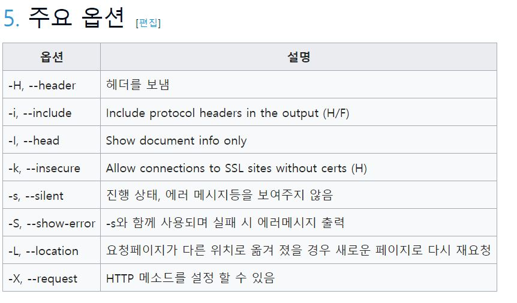

2019 11 6


서버 통신 시 확인할 수 있는
스크립트가 여러 종류가 있다.

사용할 때 항상 구글링해서 사용하고
여러 옵션에 비슷비슷해서 외워지질 않는다.


## 1. telnet
https://zetawiki.com/wiki/%EB%A6%AC%EB%88%85%EC%8A%A4_telnet
 - telnet 접속용 클라이언트...이기는 하지만 다른 컴퓨터(서버)의 **포트 점검용**으로 쓰이는 경우가 많다.
 - 유닉스 계열, 즉 AIX, 리눅스, 맥OS 등에는 기본으로 설치되어 있는 것이 보통이다.
 - 윈도우에도 포함되어 있지만 기본으로 설치되지는 않는다.

```console
연결 성공
[hanadmin@gm-***-web1 ~]$ telnet game.daum.net 443
Trying 10.63.72.74...
Connected to game.daum.net.
Escape character is '^]'.

연결 실패
[root@localhost ~]# telnet 192.168.0.13 22
Trying 192.168.0.13...
telnet: connect to address 192.168.0.13: Connection timed out
```

## 2. nslookup
https://zetawiki.com/wiki/%EB%A6%AC%EB%88%85%EC%8A%A4_nslookup
 - **도메인 네임서버의 정보를 쿼리하기 위해** 사용
 
 ```console
 도메인 확인 성공
[john@ubuntu:~]$ nslookup naver.com ns1.naver.com
Server:		ns1.naver.com
Address:	125.209.248.6#53

Name:	naver.com
Address: 125.209.222.141
Name:	naver.com
Address: 210.89.164.90
Name:	naver.com
Address: 210.89.160.88
Name:	naver.com
Address: 125.209.222.142

실패
[hanadmin@gm-***-web1 ~]$ nslookup naver32r.com
Server:         10.20.30.40
Address:        10.20.30.40#53

** server can't find naver32r.com: NXDOMAIN

 ```
 
## 3. curl
https://zetawiki.com/wiki/%EB%A6%AC%EB%88%85%EC%8A%A4_curl
 - 다양한 프로토콜로 데이터를 전송하는 라이브러리, 명령줄 도구, 그 프로젝트
 - 원격서버(FTP, HTTP 등)에서 파일 받아 보여주는 도구[1]
 - **명령행 기반 웹 요청 도구. 특히 REST 애플리케이션을 개발 테스트시에 유용하게 사용**할 수 있다. 

```console
기본
$ curl google.com
  % Total    % Received % Xferd  Average Speed   Time    Time     Time  Current
                                 Dload  Upload   Total   Spent    Left  Speed
100   219  100   219    0     0   1273      0 --:--:-- --:--:-- --:--:--  1273<HTML><HEAD><meta http-equiv="content-type" content="text/html;charset=utf-8">
<TITLE>301 Moved</TITLE></HEAD><BODY>
<H1>301 Moved</H1>
The document has moved
<A HREF="http://www.google.com/">here</A>.
</BODY></HTML>

1) 헤더 정보 보기
$curl -I google.com

2) 헤더+ 본문 보기
$curl -i google.com

3) 요청페이지가 다른 위치로 옮겨 졌을 경우 새로운 페이지로 다시 재요청
$curl -L google.com

연결 불가
$ curl seungmi.com
  % Total    % Received % Xferd  Average Speed   Time    Time     Time  Current
                                 Dload  Upload   Total   Spent    Left  Speed
  0     0    0     0    0     0      0      0 --:--:-- --:--:-- --:--:--     0
curl: (56) Recv failure: Connection was reset

```



## 4. ping
https://zetawiki.com/wiki/%EB%A6%AC%EB%88%85%EC%8A%A4_ping
 - ICMP 응답 확인 도구
 - IP 네트워크를 통해 특정한 호스트가 도달할 수 있는지의 여부를 테스트
 - 윈도우 ping과는 달리 **무한히 시도**하는 것이 기본이다.
 - 중지하기 위해서는 Ctrl+C를 눌러야 한다.
 - **특정 주소로 패킷을 보낸 후 응답을 기다리는 방식**
 -  ping 은 네트워크상으로 접근이 가능한지 확인( 상대 호스트와 연결 가능 여부 확인 )
 

```console
사용법
$  ping -c [요청수] -i [초단위 전송간격] [도메인명 혹은 IP주소]

[hanadmin@gm-***-web1 ~]$ ping -c 3 www.gooogle.com
PING www.gooogle.com (172.217.31.131) 56(84) bytes of data.
64 bytes from nrt20s08-in-f3.1e100.net (172.217.31.131): icmp_seq=1 ttl=56 time=32.1 ms
64 bytes from nrt20s08-in-f3.1e100.net (172.217.31.131): icmp_seq=2 ttl=56 time=32.0 ms
64 bytes from nrt20s08-in-f3.1e100.net (172.217.31.131): icmp_seq=3 ttl=56 time=32.0 ms

--- www.gooogle.com ping statistics ---
3 packets transmitted, 3 received, 0% packet loss, time 2002ms
rtt min/avg/max/mdev = 32.065/32.095/32.123/0.148 ms


google에 ping을 3번 
```


ping 기본 값: 8byte
ping 최댓값: 65515byte (65507 + 8)

출처: https://araikuma.tistory.com/130 


